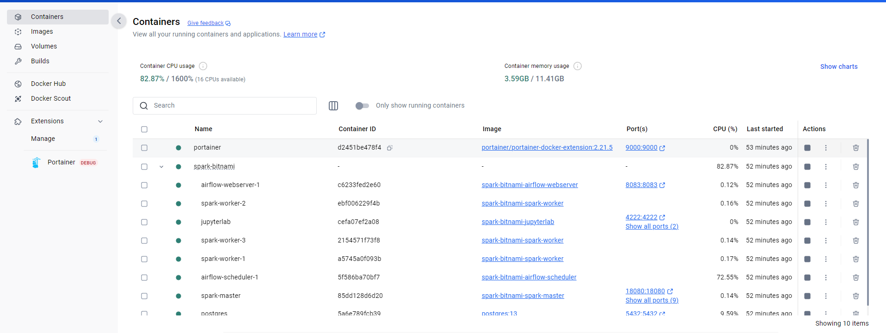
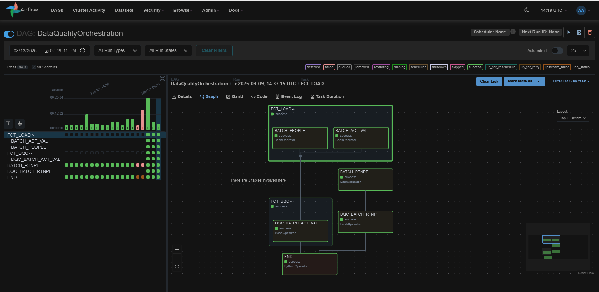

# Spark-Bitnami

> This is to test spark-sql library in local device a.k.a : Under Docker using docker compose

## Notes

- Bind App/Mian.py to container using docker compose volume or we can copy it manually to container
- docker cp -L ./App/Main.py spark-master:/opt/bitnami/spark/scripts/Main.py
- localhost:8080 for spark app UI
- localhost:4040 for spark running monitoring UI
- localhost:8888 for jupyterlab testing purposes without sumbit spark standalone
- run_spark.sh

## Development Stack

- Docker Dekstop
- Visual Sudio Code
- Dockerfile & docker-compose.yml
- Image as spark application connected to visual studio code

## Docker Command

- docker-compose up --build
- docker exec -it spark-master spark-submit --master spark://spark-master:7077 /opt/bitnami/spark/scripts/Main.py
- docker exec -it spark-master /bin/bash >>> connect to specific container
- docker exec -it spark-master spark-submit --master spark://spark-master:7077 /opt/bitnami/spark/scripts/Main.py > ./logs/app1.log 2>&1
- docker exec -it spark-master /bin/bash -c 'spark-submit --master spark://spark-master:7077 /opt/bitnami/spark/scripts/Dqc.py'
- docker exec -it -d >> -d means running from background of docker but cannot write log into local >> applicable only in docker dir
- docker exec -d spark-master /bin/bash -c '/mnt/apps/run_spark.sh --sparkname shtest --jobname shtest' >>> final by using arguments

    

## Container Access

- ctrl+p shortcut for command pallete
- remote container >>> Remote-Containers: Reopen in Container
- return back to local >>> Remote-Containers: Reopen Folder Locally
- check list of packages installed >> docker exec spark-bitnami-airflow-webserver-1 dpkg -l or pip list

## WSL Installation

- Powershell
- wsl -l -v >> after install docker desktop
- install ubuntu for linux base purpose while running apps in containers docker.sock etc
- wsl --instal -d Ubuntu
- default user : development pass : development
- Enable Ubuntu toggle in docker desktop
- Enable daemon for Airflow purposes

## Mounting

- Ensure wsl created by root or simply replace to sudo mount -t drvfs D: /mnt/d
- wsl mounted into container
- required add meta data to wsl and docker sudo mount -t drvfs D: /mnt/d -o metadata
- mount -l to see details
- sudo usermod -u 1001 spark
- sudo usermod -g root spark
- free -h >> check memory available on wsl2
- create .wslconfig under c:/user [wsl2] section
- monitor docker stats to check memory usage and I/O

## Airflow

- if you want to expose port you also need to change webserver url airflow.cfg
- cat airflow.cfg | grep 8080 to 8083 based on container default is 8080 would conflict with spark default spark you can change it to 9090

    

## Python Library Offline Installation

- Download respective library from PyPi https://pypi.org/project/psycopg2-binary/#files
- specify library version we want e.g : pandas==2.0.9 and which python version we have inside spark images or other
- pip download pandas tabulate jupyterlab -d spark/libraryPy
- pyscopg2 for airflow slim python 3.8 > psycopg2_binary-2.9.10-cp38-cp38-manylinux_2_17_x86_64.manylinux2014_x86_64.whl
- pip download pandas --python-version 38 --only-binary :all: -d ./pandas_wheels
- pip download tabulate --python-version 38 --only-binary :all: -d ./tabulate_wheels
- pip download jupyterlab --python-version 38 --only-binary :all: -d ./jupyterlab_wheels

## ssh connection setup

- makesure open ssh is installed mostly have it under linux base ssh -V or sudo systemctl status ssh
- create public keys ssh-keygen -t rsa -b 2048 -f ssh_keys/id_rsa -N "" assuming inside ssh_keys folder mount to airflow
- create authorized_keys inside ssh created to copy id_rsa.pub from above step /home/agam
- test under container to initiate log in to docker exec -it spark-bitnami-airflow-webserver-1 ssh -i /home/airflow/.ssh/id_rsa -v agam@172.27.23.224
- check local ip address under wsl >> ip addr >> see eth0